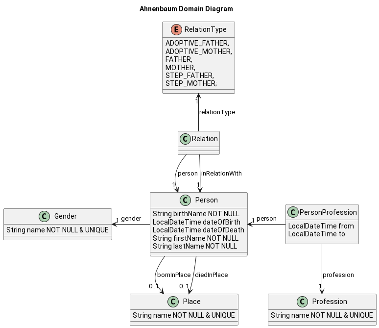

# Architecture 

This document contains architecture descriptions and documentation.

## Introduction & Goals

### Requirements Overview

TBD 

### Quality Goals

* SOLID

### Relevant Stakeholders

* People, which don't want to have their family data in a family tree web application.

## Architecture Constraints

* Clean Architecture.

## Context & Scope

TBD

## Solution Strategy

TBD

## Building Block View

### Component Diagram Level 1

Arrows pointing in direction of access.

## Runtime View

TBD

## Deployment View

TBD

## Crosscutting Concepts

TBD

### Domain Diagram

## Architecture Decisions

### Database

* Using optimistic locking to prevent data loss while saving records.

## Quality

TBD

## Risks & Technical Dept

TBD

## Glossary

TBD
